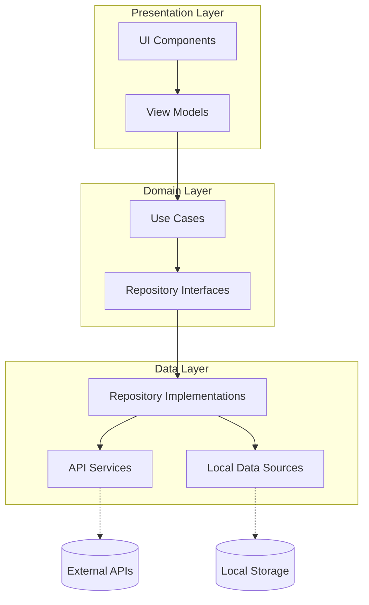

# Техническое задание на улучшение архитектуры приложения "Радио Виктория"

## 1. Введение

### 1.1 Назначение документа
Настоящее техническое задание определяет требования и спецификации для улучшения архитектуры мобильного приложения "Радио Виктория". Документ описывает цели, предлагаемую архитектуру, план миграции и технические требования для реализации улучшенной архитектуры.

### 1.2 Обзор проекта
"Радио Виктория" - мобильное приложение для прослушивания онлайн-радио, отображения погоды и гороскопа. Приложение разработано с использованием Flutter и следует паттерну Provider для управления состоянием.

## 2. Цели улучшения архитектуры

### 2.1 Основные цели
1. **Введение слоя репозиториев** - создание абстракции между источниками данных и бизнес-логикой
2. **Улучшение абстракции сервисов** - разделение ответственности и уменьшение связанности компонентов
3. **Снижение связанности компонентов** - упрощение тестирования и поддержки кода
4. **Улучшение обработки ошибок** - централизованная и последовательная обработка ошибок
5. **Повышение тестируемости** - упрощение модульного тестирования компонентов
6. **Улучшение масштабируемости** - упрощение добавления новых функций

### 2.2 Ожидаемые результаты
- Более чистая и понятная архитектура приложения
- Упрощенная поддержка и расширение функциональности
- Повышенная надежность и стабильность приложения
- Улучшенная обработка ошибок и пользовательский опыт

## 3. Анализ текущей архитектуры

### 3.1 Структура текущей архитектуры
Текущая архитектура приложения состоит из следующих слоев:
- **Presentation Layer** (UI): экраны и виджеты
- **Business Logic Layer**: провайдеры состояний (Provider)
- **Data Layer**: сервисы для работы с внешними API

### 3.2 Выявленные проблемы
1. **Отсутствие слоя репозиториев** - прямая связь между провайдерами и сервисами
2. **Недостаточная абстракция сервисов** - смешение бизнес-логики и работы с данными
3. **Сильная связанность компонентов** - провайдеры напрямую зависят от конкретных реализаций сервисов
4. **Недостаточная обработка ошибок** - ошибки обрабатываются на разных уровнях без централизованного подхода

## 4. Предлагаемая архитектура

### 4.1 Общая структура
Предлагается реализовать Clean Architecture с четким разделением на следующие слои:
1. **Presentation Layer** - UI компоненты (виджеты, экраны)
2. **Domain Layer** - бизнес-логика, use cases, модели
3. **Data Layer** - репозитории, сервисы, источники данных

### 4.2 Детализация слоев

#### 4.2.1 Presentation Layer
- **Ответственность**: отображение данных и обработка пользовательского ввода
- **Компоненты**: 
  - Экраны (screens)
  - Виджеты (widgets)
  - View Models (для связи с доменным слоем)

#### 4.2.2 Domain Layer
- **Ответственность**: реализация бизнес-логики приложения
- **Компоненты**:
  - Модели (models)
  - Use Cases (бизнес-операции)
  - Репозитории (интерфейсы)

#### 4.2.3 Data Layer
- **Ответственность**: получение и хранение данных
- **Компоненты**:
  - Реализации репозиториев
  - Сервисы (работа с API)
  - Локальные источники данных (если потребуется)

### 4.3 Диаграмма компонентов

## 5. Технические требования к новой архитектуре

### 5.1 Архитектурные требования
1. **Разделение ответственности** - каждый компонент имеет четко определенную ответственность
2. **Инверсия зависимостей** - зависимости направлены от реализации к абстракции
3. **Тестируемость** - возможность модульного тестирования каждого компонента
4. **Масштабируемость** - простота добавления новых функций

### 5.2 Требования к компонентам

#### 5.2.1 Модели
- Модели должны быть неизменяемыми (immutable)
- Модели должны содержать только данные, без бизнес-логики
- Для сложных моделей должны быть реализованы методы копирования

#### 5.2.2 Use Cases
- Каждый Use Case должен реализовывать одну бизнес-операцию
- Use Cases не должны знать о деталях реализации источников данных
- Use Cases должны обрабатывать ошибки и возвращать соответствующие результаты

#### 5.2.3 Репозитории
- Интерфейсы репозиториев должны определяться в доменном слое
- Реализации репозиториев должны находиться в слое данных
- Репозитории должны скрывать детали реализации источников данных

#### 5.2.4 Сервисы
- Сервисы должны отвечать только за работу с внешними API
- Сервисы должны возвращать чистые данные или ошибки
- Сервисы не должны содержать бизнес-логику

### 5.3 Требования к обработке ошибок
1. **Централизованная обработка** - единый подход к обработке ошибок во всем приложении
2. **Типизированные ошибки** - использование специфичных типов ошибок для разных ситуаций
3. **Пользовательские сообщения** - понятные сообщения об ошибках для конечных пользователей

### 5.4 Требования к зависимостям
1. **Внедрение зависимостей** - использование DI для управления зависимостями
2. **Минимизация зависимостей** - каждый компонент должен зависеть только от необходимых абстракций

## 6. План миграции

### 6.1 Подготовительный этап
1. Создание структуры каталогов для новой архитектуры
2. Определение интерфейсов репозиториев
3. Создание базовых моделей в доменном слое

### 6.2 Миграция по компонентам

#### 6.2.1 Аудио функциональность
1. Создание модели Audio в доменном слое
2. Создание интерфейса AudioRepository
3. Создание Use Cases для управления аудио
4. Реализация AudioRepository
5. Обновление провайдера аудио
6. Обновление UI компонентов

#### 6.2.2 Погодная функциональность
1. Создание модели Weather в доменном слое
2. Создание интерфейса WeatherRepository
3. Создание Use Cases для получения погоды
4. Реализация WeatherRepository
5. Обновление провайдера погоды
6. Обновление UI компонентов

#### 6.2.3 Гороскопная функциональность
1. Создание модели Horoscope в доменном слое
2. Создание интерфейса HoroscopeRepository
3. Создание Use Cases для получения гороскопа
4. Реализация HoroscopeRepository
5. Обновление провайдера гороскопа
6. Обновление UI компонентов

### 6.3 Финальная интеграция
1. Настройка внедрения зависимостей
2. Удаление устаревших компонентов
3. Тестирование всей функциональности
4. Оптимизация и финальная настройка

### 6.4 Этапы реализации
1. **Этап 1 (1 неделя)**: Подготовка структуры, миграция аудио функциональности
2. **Этап 2 (1 неделя)**: Миграция погодной функциональности
3. **Этап 3 (1 неделя)**: Миграция гороскопной функциональности
4. **Этап 4 (3 дня)**: Интеграция, тестирование, оптимизация

## 7. Оценка трудозатрат

### 7.1 Предварительная оценка
- Общее время: 3 недели 3 дня
- Количество разработчиков: 1
- Сложность: Средняя

### 7.2 Риски
1. Возможные проблемы с обратной совместимостью
2. Необходимость дополнительного тестирования после миграции
3. Возможные сложности с внедрением зависимостей

## 8. Критерии приемки

### 8.1 Функциональные критерии
1. Все существующие функции работают корректно
2. Новая архитектура соответствует заданным требованиям
3. Приложение проходит все тесты

### 8.2 Нефункциональные критерии
1. Улучшенная тестируемость компонентов
2. Снижение связанности между компонентами
3. Улучшенная обработка ошибок
4. Сохранение производительности приложения

## 9. Заключение

Предложенная архитектура обеспечит более четкое разделение ответственности, улучшенную тестируемость и масштабируемость приложения "Радио Виктория". Реализация этих изменений значительно повысит качество кода и упростит дальнейшую разработку и поддержку приложения.